**WebDefect**
===================

The **WebDefect** is web system designed to work with images. The main operations are computing image characteristics, displaying information on a graph and searching for defects in material images. 
The search and classification is based on a feature that the user pre-selects.

Available features for classification:
* intensity by rows;
* intensity by columns;
* silhouette by rows;
* silhouette by columns.

----------
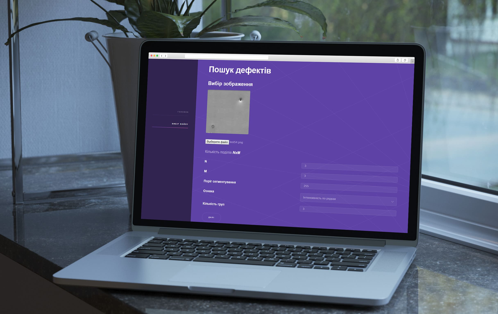
-------------
Technologies:
-------------

 - **PHP**;
 - **Javascript**;
 - **Laravel**;
 - **HTML/CSS**;
 - **Highcharts**.
 
 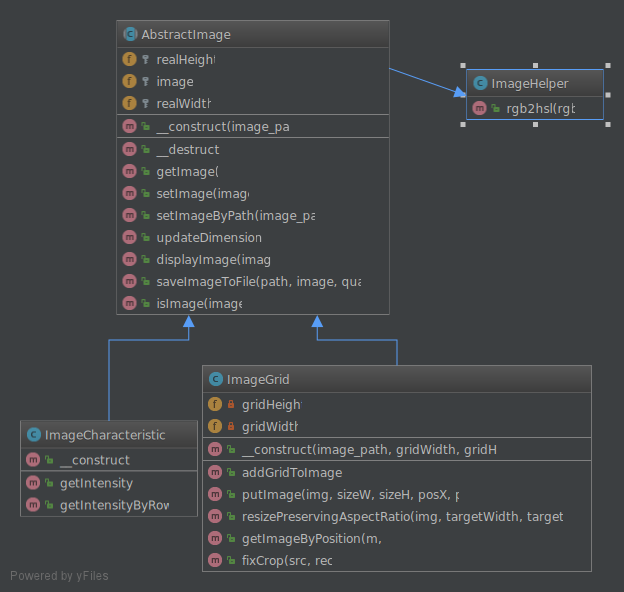

## Author

*  [**Mykhavko Ivan**](https://github.com/Tegos)

## License

This project is licensed under the MIT License - see the [LICENSE](LICENSE) file for details

## Results

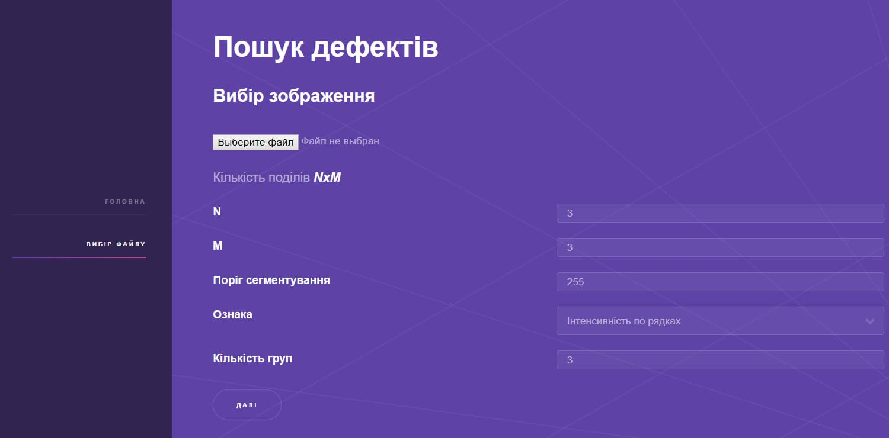
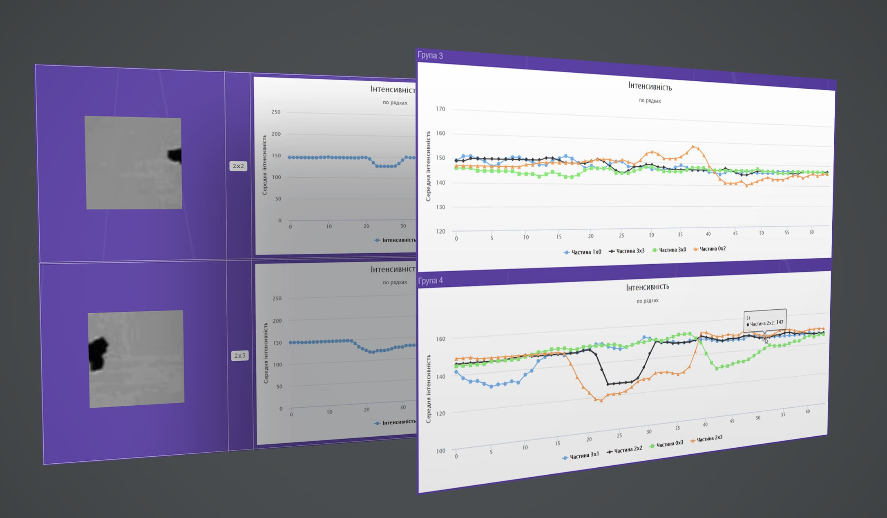
 
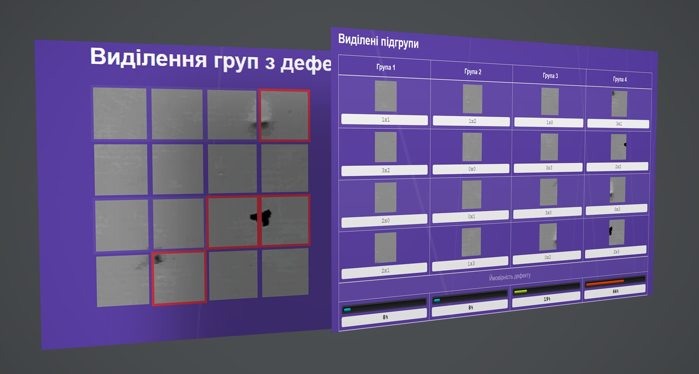
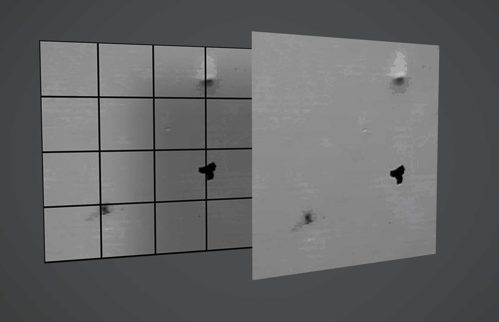
 
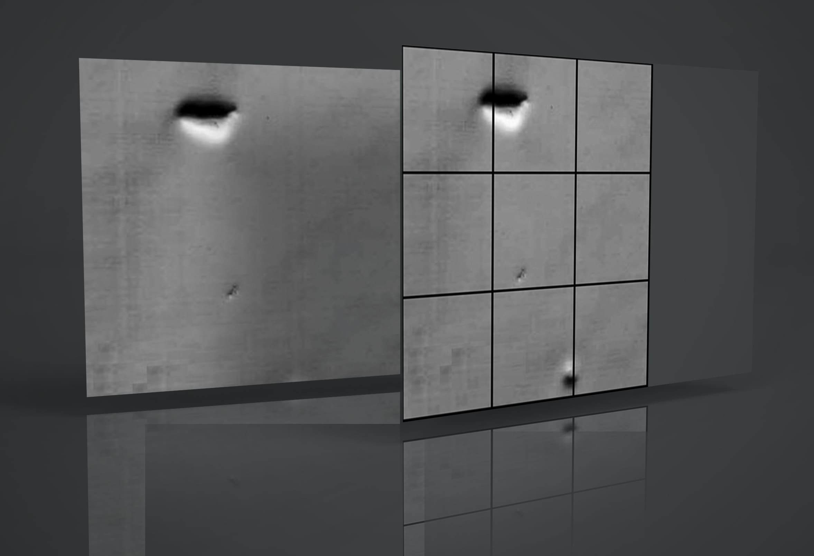
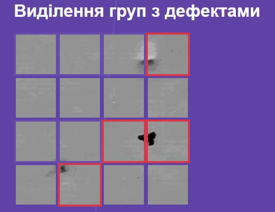
 
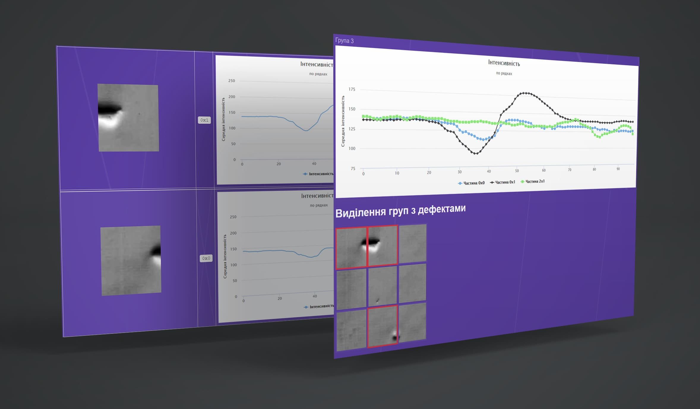
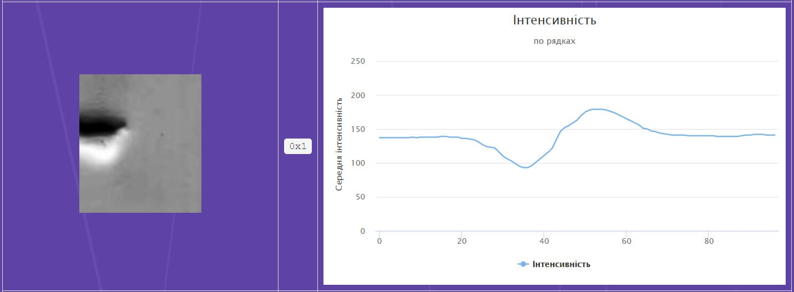
 
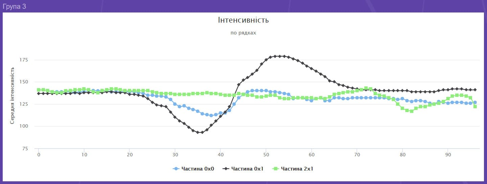
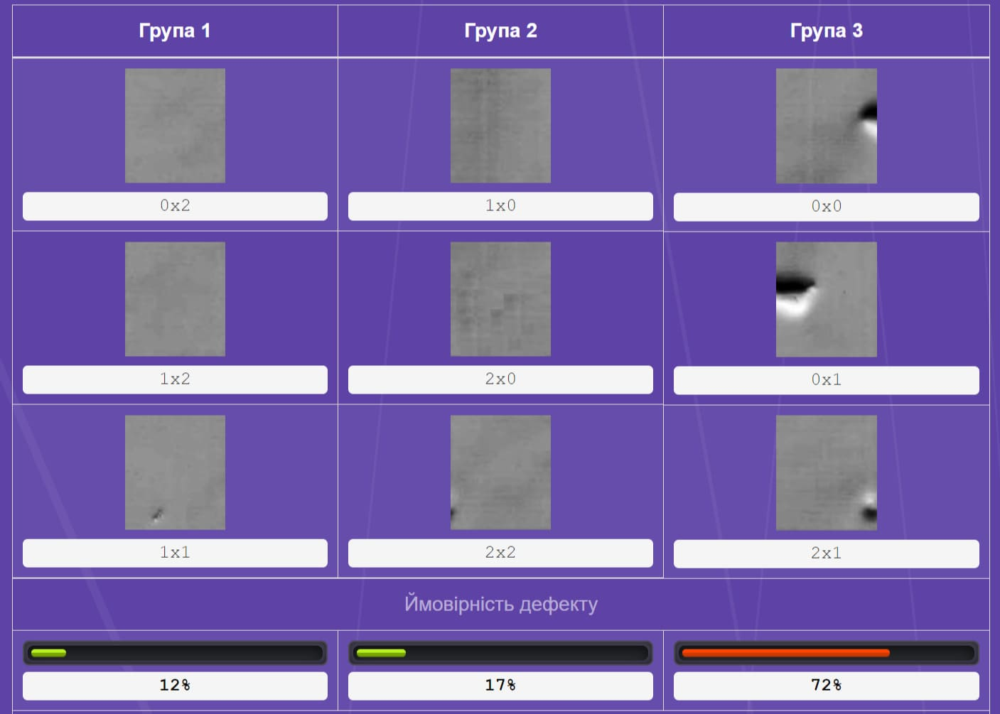

## Demo

*  [WebDefect](https://defect.ml/)
